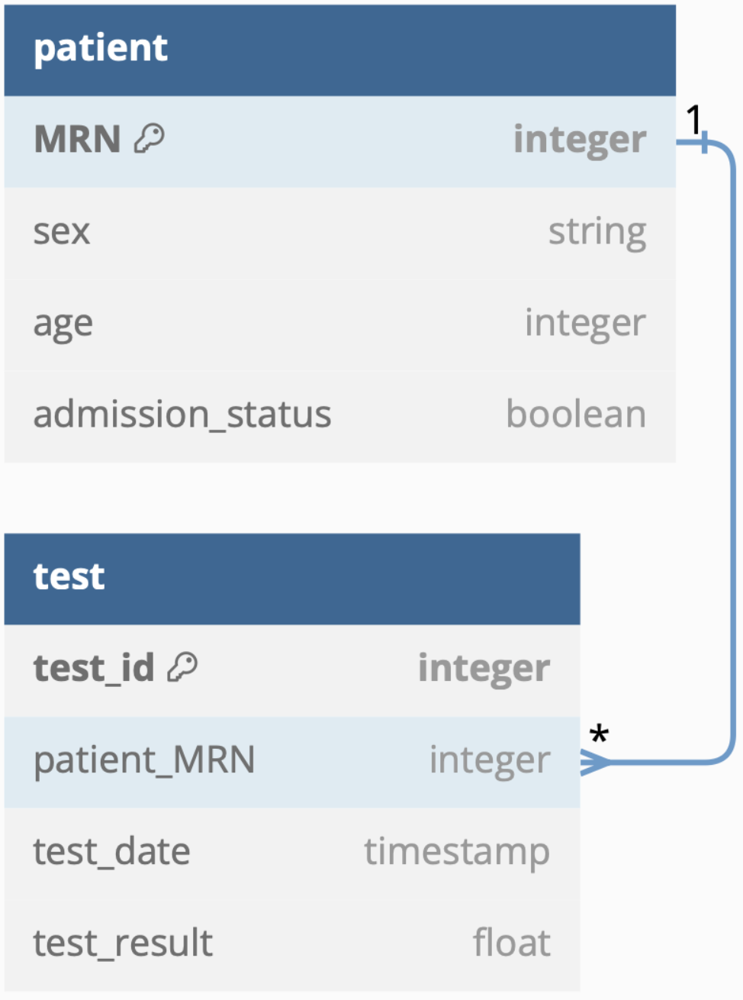

# Acute Kidney Injury (AKI) Predictor

A real-time prediction system to detect Acute Kidney Injury (AKI) from clinical temporal changes of creatinine levels using a Machine Learning model.\
Trained on **7000+** clinical samples, this ML model can correctly predict the presence of AKI with **>96%** accuracy.

The System processes real-time Health Level 7 (HL7) messages sent from the Hospital's Clinical Systems (Patient Administration System (PAS) and Laboratory Information Management System (LISM)). \
For every new blood test result, the system will run the prediction using the pre-trained model and, if AKI is detected, the system will **page** the Hospital's Clinical Response team in **less than 3 seconds** from the test result receipt.


## Requirements

The project is written in `python`. The following third party packages are required to ensure full project functionality:

- [**pandas**](https://pandas.pydata.org/): python package for data analysis, particularly suitable for handling relational and labelled data. Actively maintained (Last Updated: September 2024) and open-source.

- [**scikit-learn**](https://scikit-learn.org/stable/index.html): python package for data modeling and machine learning algorithms. Actively maintained (Last Updated: January 2025), open-source and commercially supported.

- [**joblib**](https://joblib.readthedocs.io/en/stable/): python package for fast and efficient python pipelines. Actively maintained (Last Updated: May 2024) and commercially supported

- [**hl7**](https://pypi.org/project/hl7/): python package for parsing Health Level 7 (HL7) messages.

- [**requests**](https://pypi.org/project/hl7/): python package to send HTTP requests. Actively maintained (Last Updated: May 2024) and commercially supported

All requirements (along with the used versions) can be found in the [requirements.txt](requirements.txt) file.


## System Design

The full system design specifications can be found [here](system/system_design).


## Data



All patient data from the Hospital is stored in a database, with separate tables for Patient Data and Blood Test Results data. \
To enable prediction, the input clinical data must include:

- Sex (column 'sex): as 'f' (female) or 'm' (male)
- Age (column 'age'): an Integer
- Dates of blood tests taken (columns 'creatinine_date_x'): in the format 'DD/MM/YY HH:MM:SS'
- Results of each blood test (columns 'creatinine_result_x'): indicates the measured creatinine level, as an Integer

The database is initially populated with historical patient data from a given [.csv ](data/history.csv)file.


## Example Usage
Clone this repository on your local device. Enter the directory storing the 'main.py' file ('/system/main.py').\
Start a terminal at the folder and install necessary requirements:
```console
../bin/pip3 install -r requirements.txt
```
 ### Terminal Commands
To simulate the client side of the system (without activating the hospital server side):
```console
python3 main.py
```

To simulate real-time stream of messages from the hospital server side, open another terminal at the directory storing the 'simulator' file ('/simulator/simulator.py') and run:
```console
python3 simulator.py
```
> [!IMPORTANT]  
> The server side **MUST** be activated before the system side, otherwise the connection will not be established!

 ### Docker Commands
Enter the general directory. To build the docker image from the [Dockerfile](Dockerfile), run:
 ```console
docker build -t {image_name} .
```
with *image_name* being any chosen name for the project.\
To run the image:
 ```console
docker run --net=host {image_name}
```

Optionally, the input address for the MLLP and Pager system can be specified as:
 ```console
docker run -e MLLP_ADDRESS="{chosen_mllp_address}" PAGER_ADDRESS='{chosen_pager_address}' {image_name}
```
with *chosen_mllp_address* and *chosen_pager_address* being in the format 'localhost:8440', '0.0.0.0:8440' or similar.


## Authors

- Cesare Bergossi (*cb624*)
- Ginevra Cepparulo (*gc1424*)
- Belfiore Asia (*ab6124*)
- Lisa Faloughi (*lf524*)